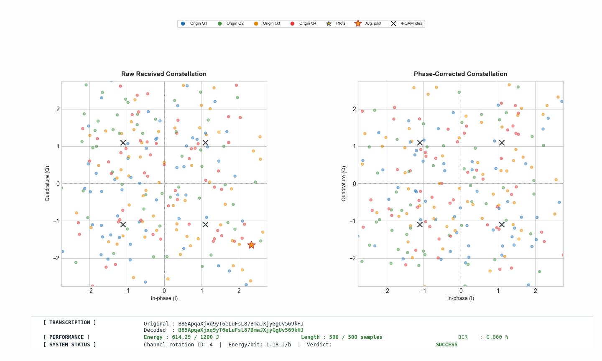

# Digital ASCII Transceiver (COM-302)

Welcome to our **Digital Communications** project as part of the course *COM-302 Principles of Digital Communications*! The core objective of this project was to design and implement a complete digital communication pipeline—specifically, a software-defined transmitter/receiver (transceiver).

Since the project guidelines required our system to support a specific 64-character alphabet using standard ASCII characters, we named it the **ASCII-Transceiver**.

> 💡 **Note on the Implementation:** Since this course focuses purely on *digital* communications, the entire analog portion of the pipeline —including the channel effects— is mocked using a Python script. Our software implementation handling the actual data stream effectively ends at the modulation stage before the simulation takes over.



---

## 🚀 Project Constraints & Objectives

We were tasked with transmitting a message under the following physical and architectural constraints:

* **Energy Constraint:** $E \le 1200\text{ J}$
* **Message Length:** $\le 500\text{ bits}$ (for a 40-character input message).
* **Target Alphabet:** `abcdefghijklmnopqrstuvwxyzABCDEFGHIJKLMNOPQRSTUVWXYZ0123456789 .`

---

## 🛠️ System Pipeline

### 1. Transmitter
* **Pilot Generation:** Creates a known sequence of identical inputs used by the receiver for channel calibration.
* **Source Coding:** Maps the character alphabet to binary bits (e.g., experimenting with Huffman coding optimized for the English language).
* **Channel Coding:** Encodes the bitstream using a Convolutional Code.
* **Modulation:** Maps the encoded bits into 4-QAM (Quadrature Amplitude Modulation) symbols.
* **Puncturing (Symbol-Level):** Deliberately discards specific modulated symbols from the stream according to a strict pattern. This shortens the transmitted sequence to meet the 500-value constraint and save transmission energy.

### 2. The Channel (Simulated Noise)
The transmitted signal passes through a simulated channel that introduces both phase rotation and thermal noise:
1.  **Random Phase Rotation:** Vertices are randomly rotated by $90^\circ$, $180^\circ$, $270^\circ$, or $0^\circ$ based on a uniform distribution:
    $$\theta \in \{0^\circ, 90^\circ, 180^\circ, 270^\circ\}$$
2.  **Additive White Gaussian Noise (AWGN):** Adds standard Gaussian noise with a mean of 0 and a variance of 1.

### 3. Receiver
* **Phase Correction:** Averages the received pilot symbols to estimate the rotation angle and rotates the signal back to its original orientation.
* **Symbol-Level Depuncturing:** Since we use Soft-Decision decoding, the receiver reinserts neutral "dummy" values (log-likelihood ratios or voltage metrics of 0) directly into the continuous symbol stream at the exact locations where symbols were discarded during transmitter puncturing.
* **Soft-Decision Decoding:** Bypasses traditional hard demodulation! The depunctured, continuous measurements from the channel are fed directly into a Soft Viterbi decoding algorithm.
* **Source Decoding:** Reconstructs the original text message from the decoded bits using the alphabet mapping.

---

## 📊 Engineering Discussion

### Optimizing the Convolutional Code $(K,G)$

The choice of the convolutional code configuration—defined by the constraint length $K$ and the generator polynomials $G$—relies primarily on its robustness to errors. This resilience is fundamentally determined by $d_{\text{free}}$, the minimum Hamming distance between any two valid codewords. 

The parameter $d_{\text{free}}$ dictates the absolute error-correction capability of the algorithm. Specifically, a convolutional code is guaranteed to correct up to:
$$\left\lfloor \frac{d_{\text{free}} - 1}{2} \right\rfloor \text{ errors}$$

Maximizing $d_{\text{free}}$ allows for a significant reduction of the $d_{\text{spacing}}$ margin in the 4QAM modulation constellation. However, this optimization introduces key architectural trade-offs:
* **Flushing Overhead:** A convolutional code $(K, G)$ requires appending $K-1$ flushing bits to the end of the message sequence to return the encoder to the zero state.
* **Puncturing Mechanism:** Because our system is strictly constrained to a 500-value table layout, we must occasionally omit data to fit structural limits. To maximize the performance of our **Soft-Decision Viterbi**, our pipeline performs **symbol-level puncturing** after the modulation stage (instead of traditional bit-level puncturing before modulation). This ensures that the receiver can seamlessly reinsert neutral values ($LLR = 0$) directly into the continuous analog-like stream before feeding it into the soft decoder.
* **Computational Complexity:** Larger values of $(K, G)$ drastically increase the state-space and execution time. 

#### Implementation & Optimization Performance
To mitigate the decoding bottleneck, the Viterbi algorithm implementation was heavily optimized via:
* **Advanced Code Design:** Streamlined state transitions and cache-friendly data structures to minimize memory latency.
* **JIT Compilation & Parallelization:** Using `@njit` (Numba) and multi-threading execution to maximize hardware utilization.

Despite these optimizations, scaling to **$K=22$** remains computationally demanding, taking approximately **4 seconds** to compute on the Apple M1 2020 chip. 

We pushed the boundaries of $K$ as far as possible because scaling up the code configuration yields consistent energy efficiency improvements. While it is impossible to scale infinitely, stopping at **$K=22$** allowed us to drive the system's operational energy down to **650**. You can see in the plot up there how, despite the high scatter and dispersion of points across the constellation diagram, the decoder successfully reconstructs the original message with **zero errors**. This is pretty impressive.


#### 📝 Fun fact on Convolutional coding 
Convolutional coding is an industry standard. It has been extensively utilized in historic deep-space missions, most notably the $(7, [171, 133])$ code deployed by NASA on the **Voyager 2** spacecraft. 

This specific configuration was chosen because it offers the optimal balance of performance gains and minimal implementation complexity. Furthermore, convolutional codes exhibit an advantageous **asymmetric complexity profile**:
* **Encoder:** Computationally lightweight and extremely energy-efficient, making it ideal for power-constrained transmitters operating for decades in deep space.
* **Decoder:** Shunted entirely to high-performance computing clusters back on Earth, where processing power is virtually unlimited.

While modern communications often utilize newer paradigms like Turbo Codes or LDPC, convolutional coding remains a highly reliable baseline standard all over the world and is still widely used, for example in Bluetooth, IoT, DAB and so on...

### The Power of Soft Viterbi Decoding

Standard Viterbi decoding operates on hard binary choices (`0` or `1`) and evaluates path metrics using the **Hamming distance**. 

In contrast, our pipeline implements **Soft-Decision Viterbi Decoding**. This architecture completely bypasses the hard demodulator block, feeding raw continuous values directly from the Analog-to-Digital Converter (ADC) straight into the decoding algorithm. 

The primary benefit of this approach is **maximizing information usage**. Instead of throwing away confidence metrics during a hard threshold step, the decoder preserves the subtle nuances of the received signal.

#### 🧩 A Simple Case Study: Hard vs. Soft Decisions

To understand the difference between hard and soft decision consider this dummy example : a simplified encoder adding a parity check bit to a 3-bit message block:
* **Sent Sequence:** `101` $\rightarrow$ **Encoded Output:** `1010`
* **Hard-Decision Receiver:** Receives `1110`. The decoder detects a parity mismatch and knows an error occurred, but it cannot confidently identify *which* specific bit flipped.
* **Soft-Decision Receiver:** Samples the raw voltage levels from the ADC, yielding a continuous vector such as `[0.9, 0.4, 0.7, 0.2]`. 

By evaluating the continuous voltages, it becomes highly evident that the second bit (`0.4`) was intended to be a `0` but suffered constructive noise interference, while the other bits remain highly unambiguous.

By fully leveraging this granular "soft" information, our decoding pipeline achieves an impressive **2 dB gain in SNR performance** compared to a conventional hard-decision architecture.

---

## 📈 Going Further

* **Energy Optimization:** A bonus was offered to the team that achieved the absolute minimum energy consumption. Due to a packed semester workload, we focused on meeting the baseline constraints rather than optimizing for the absolute minimum, but calculating the theoretical Shannon limit for minimal achievable energy remains a fascinating extension!
* **Security Track:** As a future improvement, a cryptographic layer could easily be stacked on top of the source coding phase.
* **Theoretical Bounds Analysis:** Future work could involve analytical studies to mathematically map out and predict the exact error-correcting behavior of our custom puncturing configurations under variable channel noise thresholds.

---

## 👩‍💻 For Visitors & Students

This project is an incredible learning tool. If you want to sharpen your digital communications and DSP knowledge, we highly encourage you to **delete everything except `channel.py`** and try to build your own transmitter and receiver from scratch to meet the project constraints!

If you want to explore the project, we highly recommend using the visualization. It beautifully demonstrates how messy and mixed the data constellation looks when the QAM spacing ($d$) is small, showcasing the incredible error-correcting power of the Soft Viterbi algorithm.

---

## 🚀 Usage

### 1. Environment Setup
First, create a virtual environment, activate it, and install the required dependencies:

```bash
# Create a virtual environment
python3 -m venv venv

# Activate the virtual environment
# On Linux/macOS:
source venv/bin/activate
# On Windows:
# .\venv\Scripts\activate

# Install requirements
pip install -r requirements.txt
```

### 2. Running the Transceiver

You can run the main transceiver application with a default message or specify your own:

```bash
# Run with the default message
python3 -m src.main

# Run with a custom message
python3 -m src.main "YOUR_CUSTOM_MESSAGE"
```

### 3. Testing & Validation

To validate your configuration and run stress tests on the pipeline, use the provided testing tool:

```bash
python3 -m src.tools.test
```

---

## 📜 Theory References
The mathematical derivations and theoretical exercises behind this implementation can be found in our Overleaf document:  
🔗 [View Theory Document](https://www.overleaf.com/project/6a00a5d3ddacfe8cdca0dc5a)

---

## Authors
* **[@mthoux](https://github.com/mthoux)** — Transceiver and theory
* **[@Romain-du-25](https://github.com/Romain-du-25)** — Theory
* **[@DrMoebius1](https://github.com/DrMoebius1)** — Theory

---

## 📄 License
This project is licensed under the **MIT License**. Feel free to fork it, experiment with it, share it, or use it as educational material!